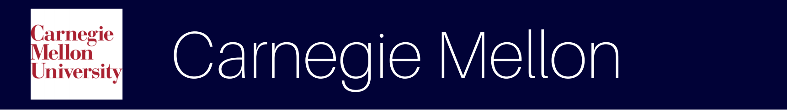
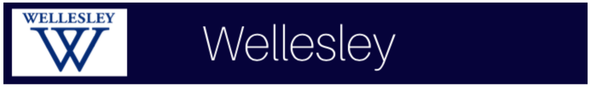

### Diversity & Inclusion across Rough Draft Ventures’ University Network

At RDV, we work with hundreds of next-generation technology leaders who have the power to drive change through the frontier technologies they are building and address key challenges facing the technology industry, including diversity and inclusion. 

In an effort to both celebrate existing diversity and inclusion initiatives across the campuses we work with, as well as provide a blueprint for student leaders to bring similar initiatives to their campuses, we’ve aggregated a list of successful programs. These initiatives provide the broader tech community with a scalable way to access diverse talent pools.

* * *

* [ALPFA](https://engage.babson.edu/organization/alpfa): Association of Latino Professionals For America (ALPFA) is the premier business organization for expanding opportunities for Latino Leadership in the global market. ALPFA creates opportunities, adds value, and builds relationships for their members, the community, and their business partners while expanding Latino leadership in the global workforce.

* [Babson Code:](https://www.babsoncode.com/) Babson Code helps Babson students develop technological skill sets to match their entrepreneurial mindsets. Code is the go-to campus resource for anything and everything tech and help guide students through the intersection of business and technology. They host a variety of events, including workshops, hosting guest speakers, networking events with companies, and peer-to-peer events within Codeplex, their living learning community.

* [ETower](http://etower.org/): ETower unites student entrepreneurs of all kind to create an innovative environment by providing a living community and space. ETower strives to provide resources for student entrepreneurs, including networking conferences, speaker series, and mentorship.

* [Lean In Circle at Babson](https://leanincircles.org/circle/babson): The Lean In Circle at Babson is intended to promote ambition and leadership among students and facilitate support for equality. The Lean In Circle also provides a network of professional women with supporting resources to empower and encourage them to achieve.

* [Boston College Women's Summit:](www.bcownit.com/) The Boston College Women's Summit (formerly known as Own It) is a one-day summit designed to empower all attendees by connecting them with a community of fellow classmates, speakers, and guests, and creating a space in which to have meaningful conversations and share game-changing ideas.

* [Computer Science Society:](http://bccss.io) The Boston College Computer Science Society (CSS) is dedicated to helping students interested in technology and entrepreneurship to achieve their goals. Throughout the school year, they host events such as guest lectures, workshops, hackathons, collaborative projects, and more. They work closely with the Computer Science department at BC to create a better environment for students to learn and find new opportunities.
[Entrepreneur Society:](http://bc.orgsync.com/org/entrepreneursociety42148/About) The Boston College Entrepreneur Society is a group of like-minded individuals with the mission of fostering entrepreneurship and promoting ingenuity through the introduction of stirring speakers and hands-on events.

* [Latin American Business Club:](http://latinamericanbc.weebly.com/) The Latin American Business Club of Boston College is a student-run organization with three main goals: 1. Create greater awareness of the social and political issues currently facing the Latin-American region by offering diverse perspectives on the ever-changing societies of these emerging economies. 2. Provide Latin American students with the tools to find great internships and work opportunities in the United States. 3.  Create a strong network that will help students connect with Latin American students and alumni from Boston College.

* [Women in Business:](www.bcwib.com/) Boston College Women in Business is an organization, network, and community of undergraduate female students dedicated to their empowerment and education. WIB is committed to the growth and expansion of professional and personal opportunities for their members, with a focus on business, leadership, and female celebration and innovation.

* [Advance, Recruit, Retain & Organize Women in STEM (ARROWS):](https://www.bu.edu/arrows/) The ARROWS mission is to organize, align, and vertically integrate programs created to advance women throughout the STEM community at Boston University.

* [Black Business Students Association (BBSA):](https://www.facebook.com/pg/BBSABu) Boston University’s Black Business Student Association (BBSA) is an active resource on campus that promotes diversity within the business world by bridging the gap between students of diverse backgrounds with alums, professionals, and companies. The end goal is for undergraduate members to gain a wide breadth of career advice and opportunities.

* [Boston University National Society of Black Engineers (BUNSBE):](http://www.bunsbe.org/) BUNSBE aims to maintain NSBE’s mission "to increase the number of culturally responsible Black engineers who excel academically, succeed professionally and positively impact the community." They are a chapter of the National Society of Black Engineers (NSBE) but accept any member who cares to support their cause or who feels that they may benefit from their efforts. We aim to serve as active member in our university, our community, and in NSBE through events, community service, and attendance of NSBE conferences.

* [Graduate Women in Science and Engineering (GWISE):](https://www.bu.edu/gwise/) Graduate Women in Science and Engineering (GWISE) at Boston University strives to create a community to support and promote women in science, technology, engineering, and math fields. Through professional development seminars and workshops, social events, mentoring, and outreach, GWISE fosters interaction across disciplines at Boston University and connects graduate students to postdocs, faculty, and broader networks in Boston and beyond.

* [Entrepreneurship at the Intersection of Diversity and Inequality:](https://brownentrepreneurshipconference.splashthat.com/) Entrepreneurship at the Intersection of Diversity and Inequality is a one-day conference that provides critical perspectives on how entrepreneurship has served as a potential pathway toward inclusion and socioeconomic mobility, particularly in times of exclusion and marginalization.

* [Hack@Brown:](http://hackatbrown.org/) Hack@Brown’s mission is to empower everyone to learn and build awesome things. Hack@Brown is driven by the core ideals of diversity, inclusivity, and mentorship and aims to build a fun-loving community at Brown and RISD surrounding learning, building, and sharing knowledge. They do this by organizing an annual hackathon, putting together regular workshops, building campus data APIs, and connecting students to the startup world.

* [Lean In at Brown:](https://leanincircles.org/chapter/lean-in-at-brown-university) Lean In at Brown strives to cultivate a strong and diverse network of support for young women, empowering them to pursue their goals with confidence and ambition. Lean In addresses the current challenges women face by means of inspiration, education, and communication, thus making a lasting impact on the blooming generation.

* [Mosaic+:](https://www.facebook.com/brownmosaicplus/) Mosaic+ is a club at Brown focused on making computer science at Brown a more receptive space for underrepresented racial minorities by fostering community and inspiring collaboration.

* [WE@Brown:](http://brownentrepreneurship.com/we-at-brown/) WE@Brown is the first intercollegiate women's empowerment conference organized by the Brown Entrepreneurship Program. Their mission is to empower women to step outside their comfort zones and pursue their passions in their professional lives.

* [WiCS:](https://cs.brown.edu/people/orgs/wics/) The goal of WiCS is to increase the participation of women in the field of Computer Science. WiCS also seeks to improve diversity and inclusion for underrepresented minorities in the tech industry through their social, mentoring, and outreach programs.

* [Women in Business:](www.brownuniversitywib.com/) Brown University’s Women in Business connects aspiring leaders with business education workshops, philanthropy, and mentorship programs that span alumnae across the country. WiB designs events particular to the female perspective, equipping young undergraduate women with the skills necessary to lead in any industry.

* [National Society of Black Engineers:](www.cmunsbe.com/) The CMU chapter of NSBE’s mission is to increase the number of culturally responsible Black Engineers who excel academically, succeed professionally, and positively impact the community.

* [Society of Hispanic Professional Engineers (SHPE):](www.cmushpe.com/) The CMU chapter of SHPE’s mission is to promote the development of Hispanics in engineering, science, and other technical professions to achieve educational and professional excellence.

* [Society of Women Engineers (SWE):](https://thebridge.cmu.edu/organization/swe) The CMU chapter of SWE values the national mission of SWE and also promotes engineering and other STEM fields for women by providing an avenue for building relationships with peers, networking with professionals, and giving back to the CMU and Pittsburgh communities.

* [Columbia National Society of Black Engineers (NSBE):](https://www.columbiansbe.org/) The Columbia NSBE chapter strives to uphold the mission of NSBE, which is "to increase the number of culturally responsible Black engineers who excel academically, succeed professionally, and positively impact the community."

* [Columbia Women's Business Society:](columbiawomensbusinesssociety.org/about/) The Columbia Women's Business Society (CWBS) is an undergraduate women's organization that aims to create a business leadership network between Columbia students and female professionals in New York City and beyond. As one of the largest pre-professional groups at the University, they are committed to helping Columbia women attain their professional goals by providing educational events, networking resources, exposure to career opportunities, and mentoring relationships with successful businesswomen.

* [Multicultural Business Association:](http://blogs.cuit.columbia.edu/mba/) The Multicultural Business Association (MBA) is an undergraduate pre-professional organization striving to bridge the gap between Columbia’s student body and large businesses by providing students with the opportunities and resources necessary to achieve their professional career goals. Their purpose is to enrich the Columbia community by engaging students with professional opportunities across the globe and across different industries. 

* [Society of Hispanic Professional Engineers (SHPE):](http://www.columbia.edu/cu/shpe/) As one of Columbia's pre-professional organizations, SHPE works to promote professional development, leadership, and community outreach through a series of panels, panels of discussions, seminars, and workshops to allow students from all backgrounds to become the next generation of Hispanic leaders. The Columbia University Chapter of SHPE is dedicated to preserving the mission and values of SHPE by providing university students with the network necessary to persevere, dedicating time to community development events, and supporting the national organization.

* [Society of Women Engineers (SWE):](www.seas.columbia.edu/swe/) As part of the Region E (Mid-Atlantic) section of SWE, the student chapter at Columbia University works to stimulate women to achieve their full potential in careers as engineers and leaders, to expand the image of the engineering profession as a positive force improving the quality of life, and to demonstrate the value of professional diversity.

* [Black Business Students Association (BBSA):](www.columbiabbsa.com/) The Black Business Students Association aims to support the personal and professional development of the black student body at Columbia Business School. 

* [Columbia Women in Business (CWIB):](https://www.cbswomen.org/) Columbia Women in Business’ (CWiB’s) mission is to foster a lifelong community that enables all Columbia Business School (CBS) women to achieve their personal and professional aspirations through programming, mentoring, coaching, and advising that provides education, support, and friendship to their members.

* [ClusterQ:](www8.gsb.columbia.edu/programs/mba/student-life/diversity/lgbt-at-columbia) Cluster Q is Columbia Business School’s LGBT Business Association and is an open and welcoming community for lesbian, gay, bisexual, transgender, and queer students, faculty members, and administrators. Cluster Q’s membership is one of the largest and most diverse LGBT groups among the world’s top business schools and also boast the largest representation of straight allies among all business schools. Cluster Q offers its members powerful networking opportunities and an extensive LGBT community, in addition to a variety of social and professional events.

* [Society for Women in Business:](cornellswib.strikingly.com/) The Society for Women in Business (SWIB), affiliated with Cornell's Dyson School, is the largest undergraduate business organization for women at Cornell, connecting students of all majors with each other and with professional leaders in the business world. They aim to empower talented and intelligent women through education and experience, providing their members with the tools to help them advance both personally and professionally.

* [Society of Women Engineers (SWE):](www.swe.cornell.edu/) The Cornell Student Section of the Society of Women Engineers promotes women in Engineering by advocating the importance of diversity and by uniting resources to encourage academic, leadership, professional, and personal excellence for the entire Engineering community of Today and Tomorrow.

* [Technology Entrepreneurship at Cornell (TEC):](http://orgsync.rso.cornell.edu/org/tec/) Technology Entrepreneurship at Cornell (TEC) is a student organization made up of graduate students and undergraduates in the engineering and sciences at Cornell University with the vision of connecting like-minded individuals interested in entrepreneurship to foster understanding of the entrepreneurial process through interactions with students, professors, business leaders, and alumni. 

* [WiTNY:](https://tech.cornell.edu/impact/witny) The mission of the Women in Technology and Entrepreneurship in New York initiative (WiTNY) is to facilitate, encourage, and enable a significant increase in the participation of women in both higher education and entrepreneurship in fields related to technology in the New York market. Through strategic initiatives and purposeful integration with key institutions and programs in the city of New York, WiTNY targets high school girls getting ready for college and undergraduate and graduate women, preparing them to secure a rewarding and lucrative position in the technology industry.

* [CUNY x Women in Tech NY Winternships:](https://drive.google.com/file/d/0BwvkTd1vx8M7QUZHMHpVN2xGbkE/view) Winternship provides paid internships to up to 200 CUNY female students in their freshman or sophomore year who are studying computer science or related fields. Participating companies so far include Verizon, OATH, Accenture, Citi, Turner, AppNexus, Grand Central Tech, Bitly, Blackstone, and many others.

* [Four94:](four94.org) Four94 aims to empower women to be entrepreneurs by providing them with the network, confidence, and knowledge to start their own companies. Some of their initiatives include: Scratchpad Fellowship, Vignette Series, and Open Office Hours.

* [Harvard African Business and Investment Club (HABIC):](http://harvardafricabusiness.org) HABIC promotes better understanding of ethical business and investment and its relation to development by bringing together Harvard College students and experts from academia, business, finance, and development fields.

* [Smart Women Securities:](http://www.smartwomansecurities.com/harvard/index.html ) Harvard Smart Woman Securities (SWS) seeks to provide undergraduate women with the skills necessary to make investment decisions through market education, exposure to industry professionals, and real-world financial experience.

* [WECode:](http://www.wecodeharvard.com/) WECode (Women Engineers Code) is the largest student-run Women in Computer Science conference. Their mission is to expand the skills, network, and community of technical women worldwide. They bring together women over the course of two amazing days to share ideas and conversations on technology and innovation.

* [WiCS:](www.harvardwics.com/) Harvard Women in Computer Science is an organization dedicated to building a community of technical women at Harvard and beyond. They seek to empower women to consider careers in technology by providing education, mentorship, and role models for students at Harvard and in the greater Boston community.

* [Women in Business:](www.huwib.org/) Women in Business strives to empower a dynamic group of enterprising young women by uniting them through business education and experience. With 8 sub-committees and 13 executive board positions, the members of HUWIB strive to develop programming that will introduce aspiring business leaders to the diverse range of opportunities in business. 

* [AASU (African American Student Union):](http://www.hbs.edu/mba/student-life/activities.../club-details.aspx?...africanamericanstuden) AASU strives to foster an environment for their members to develop strong personal and professional relationships with the black community within and outside of HBS, engage the broader HBS community, excel academically, and make a positive impact on the community.

* [Latino Student Organization:](http://www.hbs.edu/mba/student-life/activities-government-and-clubs/Pages/club-details.aspx?name=latinostudents) The Latino Student Organization proudly promotes the Latino culture at the Harvard Business School and throughout their careers.

* [Lesbian, Gay, Bisexual, & Transgender Student Association (LGBTSA):](http://www.hbs.edu/mba/student-life/activities-government-and-clubs/Pages/club-details.aspx?name=lgbtsa) LGBTSA is a group of LGBT students, partners, and straight allies. They work to maintain a supportive environment for LGBT students in the classroom, in corporate recruiting, and on campus.

* [Series W:](wsahbsclub.com/initiatives/seriesw/) The goal of Series W is to create a network of talented individuals to support each other, no matter the stage, or series, of their big ideas. Series W is dedicated to empowering women entrepreneurs and early stage investors at HBS, connecting those women pursuing bold ideas, being a resource for women with an idea who need help getting it off the ground, and bringing together women interested in angel & VC investing.

* [Women's Student Association (WSA):](http://wsahbsclub.com/) WSA’s mission is to connect, empower, and celebrate the next generation of women leaders, engaging the HBS community in the continued pursuit of gender equality in the workplace and beyond.

* [Women in Investing Summit:](https://www.womenininvestingsummit.com/) The WII Summit seeks to bring together HBS alumni, industry professionals, and current MBAs for a day of open discussion about the current topics affecting the buy-side community.

* [GWAMIT:](https://gwamit.scripts.mit.edu/gwamit-exec/) Graduate Women at MIT is a student-led organization dedicated to the personal and professional development of women graduate students at MIT. As a subcommittee of the Graduate Student Council, they provide a unified voice for MIT’s graduate women. 

* [GW6:](gw6.scripts.mit.edu/) Graduate Women in Course 6 (GW6)’s mission is to provide EECS graduate women with an environment in which to develop mentorships and friendships and to gain support and encouragement in completing their degree.

* [Society of Women Engineers (SWE):](http://swe.mit.edu/) Strives to inspire younger generations about engineering, encourage the notion of diversity in engineering, and determine and advocate for the needs of women engineers at MIT and the broader community.

* [Breaking the Mold Hackathon:](http://www.mitbreakingthemold.com/) Breaking the mold is a student-led initiative at MIT Sloan that has as its vision improving diversity in leadership groups. The hackathon is an intense, interactive, one-day event to build tools to combat unconscious bias and intolerance held at the MIT Media Lab. 

* [Sloan Women in Management (SWIM):](http://www.sloanwomeninmanagement.com/) SWIM works to increase opportunities for all women at MIT Sloan through networking events, speaker series, professional development workshops, and mentorship programs

* [Black Business Students Association (BBSA):](https://sloangroups.mit.edu/blackbusinessstudentsassociation/about/) Seeks to build a community that supports black students in their personal and professional goals and promotes business issues related to the black community. 

* [Latin American Business Club:](https://sloangroups.mit.edu/labc/about/) Mission is to strengthen the Latin community within MIT Sloan and to promote the Latin culture within MIT.

* [Sloan LGBTQI:](https://sloangroups.mit.edu/sloanlgbtqi/about/) Fosters and promotes an open and honest environment for lesbian, gay, bisexual, and transgendered students, partners, faculty and staff in the Sloan community. 

* [South Asia Business Club:](https://sloangroups.mit.edu/southasiabusiness/about/) To foster an appreciation of South Asian culture at the MIT Sloan School of Management and promote any management-related activities that connect students with South Asian businesses.

* [Ask Me Anything (AMA) Series:](http://mitsloan.mit.edu/student-blogs/mba-2017/ask-me-anything-series-embracing-sloans-diversity-and-influencing-world-views/) Safe spaces where students embracing Sloan’s diversity and influencing world views by hearing from fellow classmates on their respective journeys and identities. Past AMAs have included Growing up Black or Latino in the U.S., Being Muslim in America, Being LGBTQI in Business, and more. 

* [Association of Latino Professionals for America:](http://neu.orgsync.com/org/alpfanu/) The Northeastern chapter of ALPFA’s mission is to empower diverse leaders through professional development, networking, and job opportunities. Their meetings are focused on helping students progress their business professional skills in a positive environment.

* [Black Engineering Student Society (BESS):](www.coe.neu.edu/orgs/bess) The BESS mission is to form a network for and solidarity among student engineers, building a support system for engineers to ensure that they would stay in the field. 

* [Northeastern University Women in Technology (NUWIT):](https://nuwit.ccs.neu.edu/) NUWIT is a special interest group that supports women who study or are interested in Computer and Information Science at Northeastern University.

* [oSTEM at Northeastern University:](www.coe.neu.edu/orgs/ostem) oSTEM is an organization that fosters leadership for LGBTQIA+ communities within STEM fields.

* [Students Against Institutional Discrimination (SAID):](neu.orgsync.com/show_profile/130420-students-against-institutional-discrimination) Students Against Institutional Discrimination (SAID) is a coalition of student groups that works to minimize systemic discrimination at and near Northeastern University. They aim to shift Northeastern's current policies so that diversity, inclusion, and integration, are both acknowledged and embraced within the Northeastern community.

* [Women in Business:](neu.orgsync.com/show_profile/28022-women-in-business-club) The purpose of the Women in Business Club is to connect and engage Northeastern Undergraduate students to the business environment through student, professional, and personal interaction with other individuals with similar interests in the business world, its applications, and other such topics through meetings, guest speakers, workshops, and volunteer work.

* [Alliance for Diversity in Science and Engineering:](https://www.facebook.com/NYUADSE) ADSE@NYU, a chapter of the Alliance for Diversity in Science and Engineering, based at New York University, promotes diversity and inclusivity in STEM.

* [National Society of Black Engineers:](https://www.nyunsbe.org/) The NSBE chapter at NYU is all about helping members succeed in and out of school. They put together a number of programs and events throughout the year that provide members and the student body with internship and networking opportunities. They also host study groups and group outings.

* [oSTEM:](https://www.facebook.com/ostematnyu/) NYU's Out in Science Technology Engineering and Mathematics (oSTEM) chapter, promotes queer and trans diversity both at the Tandon School of Engineering and other NYU schools.

* [Pride Corp:](www.sternpridecorp.com/) Pride Corp is a professional development society aiming to build a deeper LGBTQ community within and beyond NYU.

* [WinC:](nyuwinc.org/) NYU Women in Computing (WinC) provides a community to meet fellow NYU students, faculty, and professionals from different companies around New York.

* [OPEN:](open.olin.edu/) OPEN is a club to foster community and support a safe and supportive environment for LGBTQ people and allies. Their mission is to promote awareness of, openness toward, and understanding of all sexual and gender identities and lifestyles, and to foster a safe and supportive environment for all members of the Olin and Babson communities.

* [Society of Women Engineers:](olincollege.swe.org/) Olin’s SWE chapter seeks to stimulate women to achieve full potential in careers as engineers and leaders, expand the image of the engineering profession as a positive force in improving the quality of life, and demonstrate the value of diversity.

* [Stay Late and Create (SLAC):](meet.olin.edu/olin-isms/stay-late-and-create-slac) SLAC is building community around tutorials, workshops, and group project meetings in an inclusive and collaborative environment.

* [Black Wharton:](www.blackwhartonundergrad.com/) Black Wharton is a dynamic organization that seeks to develop professional, social, and academic opportunities for African-American undergraduates interested in business or business-related issues.

* [Wharton Latino:](www.whartonlatino.org/) Wharton Latino is an undergraduate organization established with the purpose of promoting and bringing together the Latino community and those interested in Latin America. 

* [Wharton Women:](www.whartonwomen-penn.com) Wharton Women is an organization that facilitates the personal and career development of females in business.

* [Society of Women Engineers:](https://www.seas.upenn.edu/~swe/) The University of Pennsylvania Student Chapter of SWE has three primary objectives: professional development, education outreach to local high school and elementary schools, and social activities for its members.

* [Entrepreneurship Club:](https://www.princetoneclub.com/) The Princeton Entrepreneurship Club (E-Club) is an entirely student-run organization which aims to foster student entrepreneurship at Princeton and be a catalyst for entrepreneurial activity among students of all backgrounds, bringing students from a broad range of fields together to solve meaningful problems entrepreneurially.

* [National Society of Black Engineers (NSBE):](https://nsbe.princeton.edu/) The Princeton chapter of NSBE aids the professional and academic development of Black engineers and students in the math/sciences by promoting academic excellence through the form of tutoring, mentoring, and incentive programs, providing workshops such as resume writing and networking skills in order to be the ideal stepping-stone into the professional world, and providing a strong network and support system for minority engineers who voyage through Princeton.

* [ReModels:](http://women.princeton.edu/get-involved/) ReModels is an organization that provides access to the engineering field and changes the perception of engineering for future generations through an applied design experience and vibrant community.

* [Society of Women Engineers (SWE):](https://www.princeton.edu/~swe/) Princeton’s chapter of SWE is dedicated to promoting a sense of community among female B.S.E. students, professors, and alumnae of Princeton and introducing younger girls to the various opportunities offered by studying engineering.

* [Women in Business:](www.princeton.edu/~pwib/) Women in Business is an organization that seeks to empower a vibrant community of imaginative and entrepreneurial Princeton women through business exposure and experience via business-skills workshops, panels, and off-campus company visits. 

* [Women in Computer Science (WiCS):](https://sites.google.com/site/princetonwics/) WiCS is an organization with the goal of 1) supporting and mentoring women in the computer science department, and 2) doing outreach programs to interest young women in computer science.

* [National Society of Black Engineers:](https://sites.tufts.edu/nsbe/) Tufts NSBE strives to achieve its mission through the collaborative partnerships we have with the Office of STEM Diversity, Mexican Association of Engineers and Scientists, and the Society of Women Engineers.

* [Out in Science, Technology, Engineering and Mathematics (OSTEM):](tuftsenigma.org/ostem/) oSTEM provides resources to members of the Tufts community who identify as minorities in the gender or sexuality spectrums, wherever that falls for them. This includes undergraduates, graduate students, postdoctoral students, and professors. During their weekly meetings and events, oSTEM addresses issues pertinent to the lives of young queer academics.

* [WiCS:](https://tuftswics.github.io/) Women in CS (WiCS) helps connect women in computer science, provide a network of opportunities, and support all members’ endeavors.

* [CS Club:](https://www.facebook.com/Wellesley-CS-Club-856871510992038/) Wellesley CS Club is a student organization that was started to enrich the community's Computer Science experience beyond the CS curriculum. The Wellesley Computer Science Club is a chapter of both the ACM and of the ACMW.

* [WeStart:](https://www.facebook.com/wellesleystartup/posts/185998918405387) WeStart (Wellesley Startup Club) serves to encourage and help students who aspire to be entrepreneurs, in both commercial and social areas. They invite entrepreneurs to share their experiences, ideas, and visions through panels and lectures. They also hold monthly workshops in startup-related skills and knowledge, such as the process of ideation and how to make a business plan. 

* [WHACK:](wellesleyhacks.org/) WHACK, the Wellesley College hackathon, is a 36-hour hackathon that celebrates diverse identities in tech.

* [Afro American Cultural Center:](https://afam.yalecollege.yale.edu/) The House has nurtured and encouraged generations of Black Yalies to become some of world’s leading scholars, activists and professionals. 

* [Dwight Hall at Yale:](http://dwighthall.org/) Dwight Hall is a 501(c)(3) not-for-profit organization that reflects a diverse Yale student body and a strong history of social justice work in New Haven and beyond. Dwight Hall at Yale is an independent, nonsectarian umbrella organization, and the largest campus-based student-run service organization in the country. 

* [Black Student Alliance at Yale (B.S.A.Y.or BSAY):](http://bsayale.squarespace.com/) BSAY was formed to advocate for increased black enrollment, the development of Afro-American Studies, improved relations with the African American community of New Haven, and the establishment of a cultural center for black students on Yale’s campus.

* [Greenberg World Fellows Program:](https://worldfellows.yale.edu/about/program) Greenberg World Fellows Program provides the opportunity for World Fellows to contribute to Yale’s intellectual life, participate in events, collaborate with peers, audit classes, mentor students and lead roundtable discussions. In doing so, it exposes emerging global leaders to new ideas and ways of doing and thinking. Brilliant minds are refreshed, challenged and expanded. Their Fellows come from diverse backgrounds and disciplines, but they share much in common: they are dynamic practitioners, capable leaders, of extraordinary character, and committed to using their energy and talents to make a positive difference in the world. 

* [La Casa Cultural Center:](https://lacasa.yalecollege.yale.edu/) La Casa Cultural Center is a resource & community for Latino students, providing career and networking opportunities.

* [Native American Cultural Center:](https://nacc.yalecollege.yale.edu/) The Native American Cultural Center (NACC) promotes American Indian, Alaska Native, and Native Hawaiian culture and explores the issues that Native Americans face in today’s world. The Center works to expose the Native community, as well as the greater Yale community, to Native American issues and culture by bringing programming to campus that includes events such as speakers, artist talks and installations, and conversations with leading Native intellectuals. 

* [Office for Equal Opportunity Programs:](https://equalopportunity.yale.edu/) Office for Equal Opportunity Programs is a resource for any student, employee, or applicant for programs or employment at Yale who is concerned about affirmative action, equal opportunity, sexual harassment, racial harassment, or fairness in admissions or employment at Yale, either in a general sense or with respect to his or her own situation, is encouraged to contact the Office for Equal Opportunity Programs.

* [The Office of LGBTQ Resources:](https://lgbtq.yale.edu/) The Office of LGBTQ Resources works to create a visible LGBTQ community that includes staff, faculty and students from all of Yale’s schools and from a wide variety of life experiences. We actively network with other Yale offices that advocate in support of diversity. 

* [Smart Women Securities:](http://www.smartwomansecurities.com/yale/) WSmart Women Securities is a women’s finance network and group.

* [Women in Science At Yale (WISAY):](http://wisay.sites.yale.edu/) WISAY is a group dedicated to promoting the interests of women in science, technology, engineering, and mathematics (STEM),supporting women scientists, and advocating for gender equality in all fields.

* [Women’s Leadership Initiative (WLI):](https://admissions.yale.edu/womens-leadership-initiative) WLI seeks to empower future women leaders by creating a campus culture that emphasizes women’s leadership efforts among the various experiences offered at Yale and in the world. 

* [Women’s Leadership Program:](som.yale.edu/programs/executive-education/for.../womens-leadership-program) Women’s Leadership Program consists of online videos pre-program and implementations plans post-program extend the impact of an intensive in-person workshop. Yale faculty will lead a wide range of interactive and experiential learning sessions proven to enhance women’s leadership behaviors. Participants build awareness of decision-making biases, learn how to create high-performing teams, negotiate win-win outcomes, manage crises, understand corporate governance, and create a strong personal brand.

* * *

If we’re missing your school or group/initiative, let us know! 

* * *

If you’re a student looking to take your startup, company, or project to the next-level, drop us a line & let’s explore what we can build together. For more information about Rough Draft Ventures, visit [our website](http://www.roughdraft.vc/) or follow us on [Twitter](https://twitter.com/roughdraftvc)!
